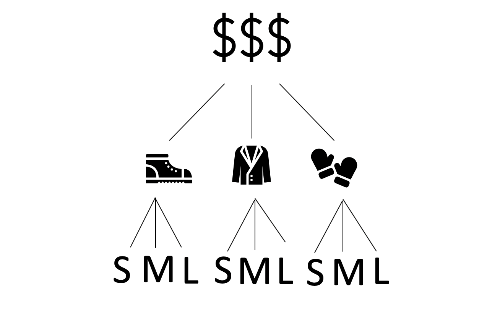
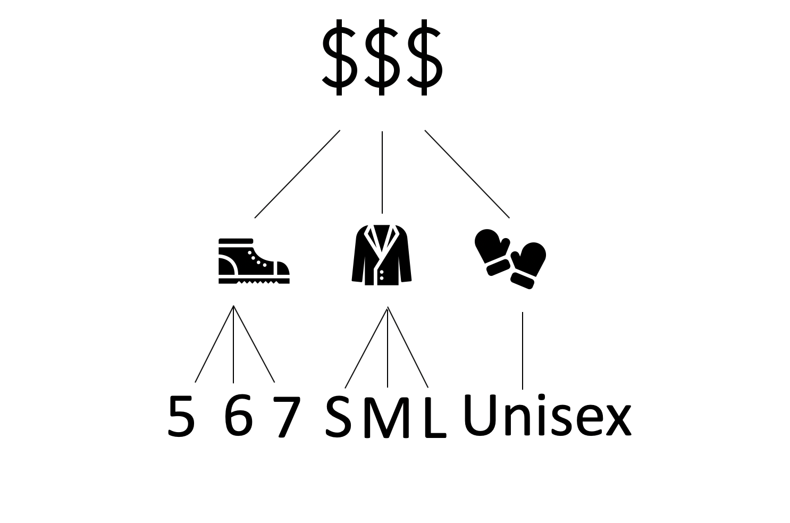
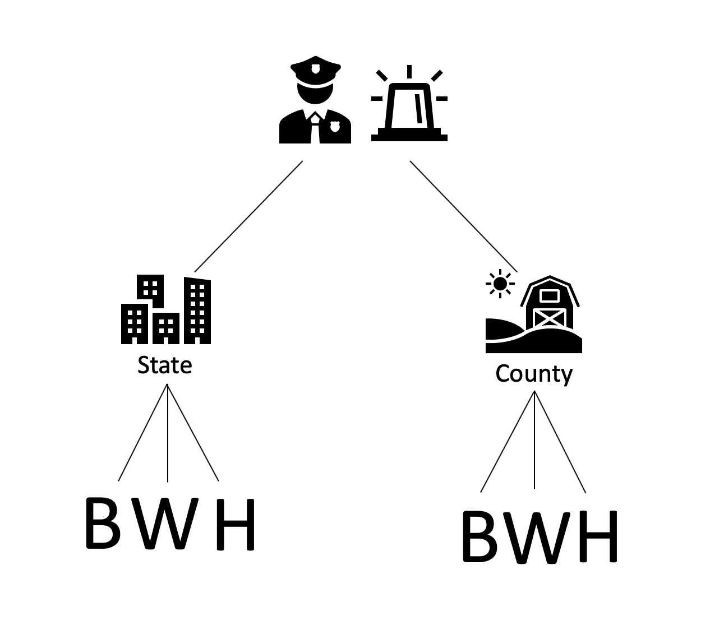

# Introduction 
This post is for all who were ever confused on whether to fit a model with crossed versus nested random effects. I assume a basic understanding of linear models and hiearchical models, but in case the reader doesn't have that knowledge, here is a quick refresher. Hierarchical Modeling is a type of model that allows us to use all of our data in savy and interesting ways. With this type of model, we are completing two estimation tasks at once. The first is to try to learn about each group separately, and the second is to learn about the population across all groups. The main benefits of modeling the data in this way include: 

- improved estimates for $\textbf{repeat samples}$, that is when your data has more than one observation for the same individual, location, or time etc. 

- improved estimate for $\textbf{unbalanced samples}$, that is when some observations are sampled more than others. For example, in a medical study, among different racial groups, you might have more observations for people who identity as `White` than `Black` due to selection bias and/or mistrust of doctors that may exists in some communities. 

- provides estimates of $\textbf{variation}$ among individuals or groups within the data. 

A typical model set up looks like this: 

$$
\begin{aligned}
y_{ij} &= \beta_{0,j} + \beta_{1,j}x_{ij} + \epsilon_{ij} \\
\beta_{0,j} &= \beta_0 + b_{0,j} \\
\beta_{1,j} &= \beta_1 + b_{1,j} \\
\bigg(\begin{array}{c}  b_{0,j} \\ b_{1,j}  \end{array}\bigg) &\stackrel{iid}{\sim} N\bigg(\bigg(\begin{array}{c}  0 \\ 0 \end{array}\bigg) ,\bigg(\begin{array}{cc}  \tau_{11} & \tau_{12} \\ \tau_{12} & \tau_{22} \end{array}\bigg) \bigg) \perp \epsilon_{ij} \stackrel{iid}\sim N(0, \sigma^2)
\end{aligned}
$$

where maybe $i = 1, \cdots ,m$ families and $j = 1, \cdots, n_i$ children within family $i$. This also happens to be aclassic example of a model that has nested data because it uses the familiarity we have with childen being nested in specific families. Which brings us to the main topic of this  post: Nested versus Crossed Random Effects.

When trying to understand hierarchical models, it is easy to get confused by the different hiearchies that can exist within your data. Specifically, it can be difficult to understand when to use crossed versus nested random effects (It can also be difficult trying to understand when to use fixed versus random effects but that is not our focus in this blog. See references for more info). It is important to note, whether your random effects are going to be cross versus nested are entirely a property of the data, and not the model. 

Let's start with some intuitive definitions: 

- $\textbf{Nested random effects}$: when each member of one group can be also be found within another group. That is across different groups, there are no unique labels. 

- $\textbf{Crossed random effects}$: when random effects are not nested, they are called crossed. That is across different groups, each label is unique to that individual. 

Now we can look at an example and then work our way up to a more complex one for illustrating nested and crossed random effects. A lot of other resources on the internet give the common example of children nested in classrooms or families, so for this blogpost, I thought a novel example might be helpful (You can never have too many examples!). 

```{r libraries, include = FALSE}
library(magrittr)
library(dplyr)
library(tidyr)
#library("dplyr")
library("ggplot2")
library(stringr)
library("tidyverse")
#library(plyr)
library("lubridate")
library(psych)
#install.packages("readxl")
library(readxl)
library(brms)
#install.packages("ggthemes")
library("ggthemes")
#install.packages("plotly")
library(plotly)
library(maps)
#install.packages("mapproj")
library("mapproj")
library("lme4")
library("kableExtra")
library(grid)
library(gridExtra)
#install.packages("varhandle")
library(varhandle)
#install.packages("truncnorm")
library(truncnorm)
require(lattice) 
library(gganimate)
#install.packages("gifski")
```

# Nested vs. Crossed {.tabset .tabset-pill}

In this example, we will look at simulated data on winter clothing (i.e. boots, jackets, and gloves) with `Size` and `Product` as predictors and an outcome variable `Price`. 

```{r simulate data, include=FALSE}
set.seed(888)

#price <- c(rep("9.99",3), rep("15.99",3), rep("14.99",3), rep("17.99",3),rep("29.99",3),rep("25.99",3), rep("5.99",3), rep("10.99",3), rep("7.99",3))
s_price <- round(rtruncnorm(3, a=10, b=20, mean = 15 , sd = 10),2)
m_price <- round(rtruncnorm(3, a=20, b=30, mean = 25 , sd = 4),2)
l_price <- round(rtruncnorm(3, a=2, b=10, mean = 5 , sd = 2),2) 
price <- rep(c(s_price,m_price,l_price),3)
product <- c(rep("boots", 9), rep("jackets",9), rep("gloves", 9))
size <- c(rep(c(rep("s",3), rep("m",3), rep("l",3)),9))

winter_clothes <- cbind(price,product,size)
winter_clothes <- as.data.frame(winter_clothes)
winter_clothes$price <- unfactor(winter_clothes$price)

winter_clothes <- winter_clothes %>% mutate(price = case_when(product == "boots" ~ price  , product == "jackets" ~ price + 10, product == "gloves" ~ price +4) )

#View(winter_clothers)

```


## Nested Data {.tabset .tabset-fade .tabset-pill}
```{r nested data, include=FALSE}

#> Loading required package: ggplot2

# We'll start with a static plot
p <- ggplot(winter_clothes, aes(x = product, y = price)) + 
  geom_point() 
```

```{r nested, echo=FALSE, cache=TRUE, fig.cap="Nested Groups",fig.align = "center", out.height= '30%',out.width = "50%", fig.show='hold'}


  
```
 
 
```{r}
winter_clothes
```

```{r nested animation, cache = TRUE, include = FALSE, fig.align="center", out.height= '30%',out.width = "50%", fig.show='hold'}
anim <- p + 
  transition_states(size,
                    transition_length = 2,
                    state_length = 1)

anim + ggtitle('Now showing {closest_state}')
```

We can model the data in multiple ways, but for this blog we will focus on the two ways being crossed or nested random effects models. 

### Crossed Model 

This model is saying that there is a lot of heterogeneity by product and by size. We believe that the size levels vary across products in the same way, that is there small boots vary in the same way as small gloves. But our common knowledge should make us question this assumption and instead we want to be able to distinsh small boots from small gloves, etc. In the results from the model, size makes up a large percentage of the variation within the data, and there is considerable variability across the differnt products. But that is not the full story! Click the Nested Model Tab.

```{r nested wrong, warning = FALSE, message = FALSE}
nested_wrong <- lmer(price ~ (1|product) + (1|size), data = winter_clothes)
summary(nested_wrong)

```

```{r, echo = FALSE, fig.align="center"}
grid.arrange(qqmath(ranef(nested_wrong, condVar=TRUE))$product, qqmath(ranef(nested_wrong, condVar=TRUE))$size, ncol = 2)
```

### Nested Model

Instead, we want the model to treat small boots as being different from small gloves so we must include size as a nested random effect within product. This  considerably reduces the variation that we see by product and we see that much of the variation is ultimately because of size. 

```{r nested right, warning = FALSE, message= FALSE}
nested_right <- lmer(price ~ (1|product/size), data = winter_clothes)
summary(nested_right)

```

```{r, echo=FALSE, fig.align="center"}
grid.arrange(qqmath(ranef(nested_right, condVar=TRUE))$product, qqmath(ranef(nested_right, condVar=TRUE))$size, ncol = 2)
```


## Crossed Data {.tabset .tabset-fade .tabset-pill}

```{r crossed, echo=FALSE, fig.cap="Crossed Groups",fig.align='center',out.width = '50%'}

```

```{r crossed sim data, include = FALSE }
price <- rep(c(s_price,m_price,l_price),3)
product <- c(rep("boots", 9), rep("jackets",9), rep("gloves", 9))
size.b <- c(rep(5,3), rep(6,3), rep(7,3))
size.j <- c(rep("s",3), rep("m",3), rep("l",3))
size.g <- rep("u", 9)
size <- rep(c(size.b,size.j,size.g),2)

winter_clothes_new <- cbind(price,product,size)
winter_clothes_new <- as.data.frame(winter_clothes_new)
winter_clothes_new$price <- unfactor(winter_clothes_new$price)

#View(winter_clothes_new)

```

```{r}
winter_clothes_new
```

```{r crossed data, include=FALSE}

#> Loading required package: ggplot2

# We'll start with a static plot
p <- ggplot(winter_clothes_new, aes(x = product, y = price, color = size)) + 
  geom_point() 

```

### Crossed Model 
In the data, the labels for size are each unique for each product type so we should get the same estimates from a croossed model as we do from a nested model. Click the next tab to find out.

```{r crossed model 1, message=FALSE }
crossed1 <- lmer(price ~ (1|product) + (1|size), data = winter_clothes_new)
summary(crossed1)
```

```{r,echo=FALSE, fig.align="center"}
grid.arrange(qqmath(ranef(crossed1, condVar=TRUE))$product, qqmath(ranef(crossed1, condVar=TRUE))$size, ncol = 2)
```

### Nested Model
And that's exactly what we get! The size within each product accounts for a lot of the variation that we see within the data. 

```{r crossed model 2, message=FALSE }
crossed2 <- lmer(price ~ (1|product/size), data = winter_clothes_new)
summary(crossed2)

```

```{r, echo=FALSE, fig.align="center"}
grid.arrange(qqmath(ranef(crossed2, condVar=TRUE))$product, qqmath(ranef(crossed2, condVar=TRUE))$size, ncol = 2)
```


# USA Police Stops {.tabset .tabset-fade .tabset-pill}
```{r police data, include = FALSE}
combined_data <- readr::read_csv("https://raw.githubusercontent.com/5harad/openpolicing/master/results/data_for_figures/combined_data.csv")
#View(combined_data)
combined_data$state <- factor(combined_data$state)
data_state_key <- c(AZ = "arizona", CA = "california", CO = "colorado", CT = "conneticut", FL = "florida", IL = "illinois", MA = "massachusetts", MT = "montana", NC = "north carolina", NJ = "new jersey", OH = "ohio", RI = "rhode island", SC = "south carolina", TX = "texas", VT = "vermont", WA = "washington", WI = "wisconsin")
combined_data$state <- recode(combined_data$state, !!!data_state_key)
combined_data <- combined_data %>% mutate(total = stops_per_year/stop_rate) %>%  drop_na(stop_rate) %>% filter(!(stop_rate > 1)) %>% mutate(county = location)
```
Now, let's look at some real data. We will be looking at policing data in the US from 17 different states including Arizona, California, Colorado, Conneticut, Florida, Illinois, Massachusetts, Montana, North Carolina, New Jersey, Ohio, South Carolina, Texas, Vermont, Washington, Wisconsin. After some cleaning and data manipulation, there are `r nrow(combined_data)` observations. The data includes variables such as: county, state, driver_race, stop rate, stops_per_year, search rate, and arrest rate. 


```{r map, fig.width=13, echo = FALSE, message=FALSE, warning=FALSE}

#us map
us_states <- tbl_df(map_data("state"))

## state stops per year
state_stops<- combined_data %>% 
  group_by(state) %>% 
  summarise(total_stops = sum(stops_per_year)) %>% 
  select(state, total_stops) %>% 
  mutate(region = state)

# Join the values to the map

us_stops <- right_join(us_states, state_stops)

# Plot it

map1 <- ggplot() +
  geom_polygon(data=us_stops, color="black",
               aes(x=long, y=lat, group=state, fill=total_stops)) +
  scale_fill_gradient(name="Total Stops", labels = scales::unit_format(unit = "K", scale = 1e-3), low = "white", high = "#2E74C0") +
  coord_map("polyconic") +
  ggthemes::theme_map() +
  theme(legend.position="left")

map1


```
For our model, we will focus on modeling stop rate with driver_race, state, and county as predictors to try and determine if there is any bias in police stops across the US. Due to the coding of the data, we are faced with the same question asked in the title of this blog, should we use crossed or nested random effects?

```{r police image, echo=FALSE,fig.align='center',out.width = '50%'}

```


## Crossed Model 

When we fit a crossed model, we notice that `county` captures a lot of the variability within our model but `driver_race` not so much. 

```{r model, message=FALSE,warning=FALSE}

crossed_mod = glmer(stop_rate~ (1|driver_race) + (1|state) + (1|county),  
               weights = total,
               data = combined_data,
               family = "binomial")

summary(crossed_mod)

```

```{r,  echo=FALSE, fig.align="center"}
grid.arrange(dotplot(ranef(crossed_mod, condVar=TRUE))$state, dotplot(ranef(crossed_mod, condVar=TRUE))$driver_race, ncol = 2)
```


### Crossed Model BIC: 
```{r bic crossed, echo = FALSE}
BIC(crossed_mod)
```

## Nested Model
However, when we fit a nested model, `driver_race` starts to account for a lot more variability in our data. We cannot say anything conclusive about whether there is racial bias in police stops from fitting just these two models. More work would need to be done in order to show that. In fact more work has been done extensively to answer this question and they are included in the references section (**SPOILER ALERT: Yes there is a racial bias in police stops across the US). Additionally, it turns out that our nested model has a better BIC than the crossed model. 

```{r nested model, warning= FALSE, message= FALSE}

nested_mod = glmer(stop_rate~  (1|state/driver_race) + (1|county/driver_race) ,  
               weights = total,
               data = combined_data,
               family = "binomial")

summary(nested_mod)

```


```{r re nested,  echo=FALSE, fig.align="center"}
grid.arrange(dotplot(ranef(nested_mod, condVar=TRUE))$state, dotplot(ranef(nested_mod, condVar=TRUE))$`driver_race:state`, dotplot(ranef(nested_mod, condVar=TRUE))$county, dotplot(ranef(nested_mod, condVar=TRUE))$`driver_race:county`, ncol = 2)
```

### Nested Model BIC: 

```{r BIC nested model,echo = FALSE}
BIC(nested_mod)

```


### References: 
[1] https://github.com/5harad/openpolicing

[2] https://5harad.com/papers/100M-stops.pdf

[3] http://errickson.net/stats-notes/vizrandomeffects.html